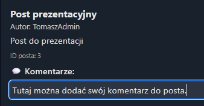
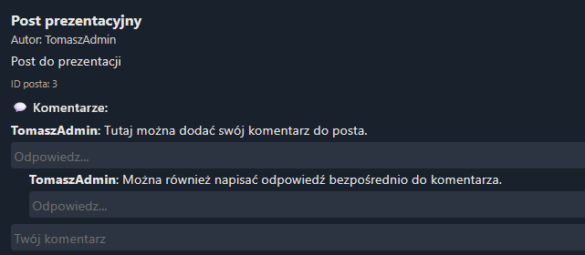
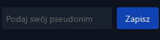

# Wioskowe Forum

Prosta aplikacja webowa stworzona z myślą o lokalnej społeczności. Umożliwia publikowanie postów oraz komentowanie ich w formie rozmów wątkowych – przypominając klasyczne forum internetowe, ale w lekkiej i nowoczesnej wersji.

---

## Funkcje

- Dodawanie postów przez użytkowników
- Komentowanie z obsługą zagnieżdżeń (threaded comments)
- Przeglądanie postów i dyskusji w czasie rzeczywistym
- Frontend oparty na czystym HTML + TailwindCSS
- Backend REST API stworzony w FastAPI

---

## Technologie

- **Python 3.11**
- **FastAPI** – backend REST
- **HTML + TailwindCSS** – prosty, lekki frontend
- **Docker + Docker Compose** – konteneryzacja
- **Render.com** – hosting aplikacji

---

## Uruchomienie lokalne (Docker)

1. Upewnij się, że masz zainstalowany Docker + Docker Compose
2. W katalogu głównym projektu uruchom:

```bash
docker-compose up --build

Aplikacja będzie dostępna pod:

   - **Backend (API):** [http://localhost:8000](http://localhost:8000)  
   - **Frontend (UI):** [http://localhost:8080](http://localhost:8080)

## Wersja online
Aplikacja dostępna pod adresem:
https://wioskowe-forum-frontend.onrender.com/


## Zrzuty ekranu

### Strona główna
Widok główny aplikacji z listą postów i interfejsem użytkownika.


### Dodawanie komentarza
Przykład pola do wpisania komentarza pod postem.


### Odpowiedź na komentarz
Zagnieżdżony komentarz jako odpowiedź – przykład threaded comments.


### Wybór pseudonimu
Widok przy nadawaniu użytkownikowi tymczasowego pseudonimu.



## Struktura katalogów
wioskowe_forum/
├── backend/           # FastAPI backend
├── frontend/          # Statyczny frontend (HTML + JS)
├── images/            # Zrzuty ekranu używane w README.md
├── docker-compose.yml
├── .gitignore
├── README.md


## Autor
Tomasz Bednarczyk
Informatyka NST. IV SEM.
Akademia Techniczno-Informatyczna w Naukach Stosowanych


## Licencja
Projekt edukacyjny stworzony na potrzeby zajęć "Systemy programowania w chmurze". Kod open-source.